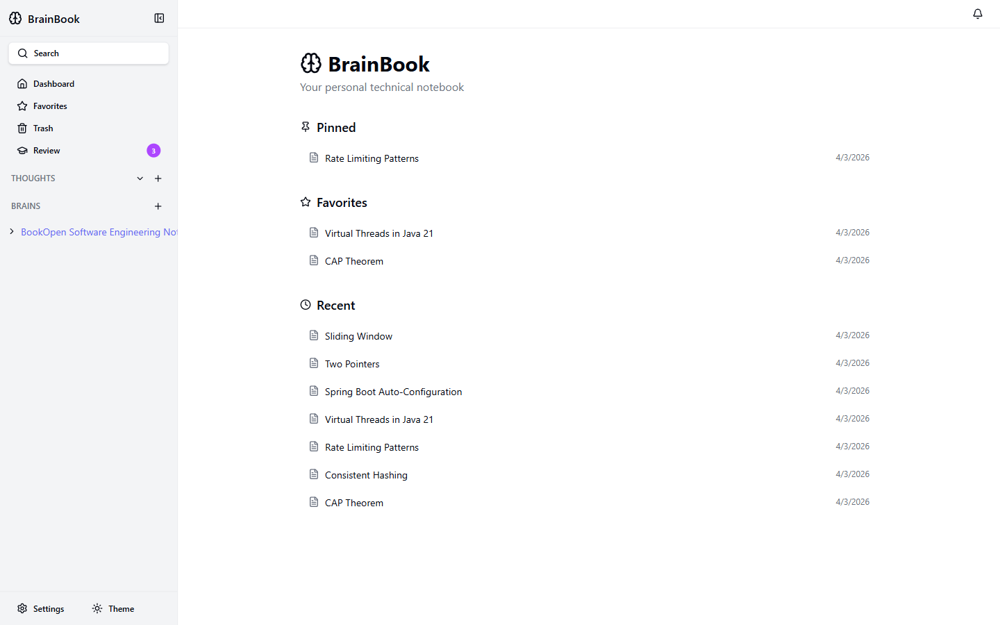
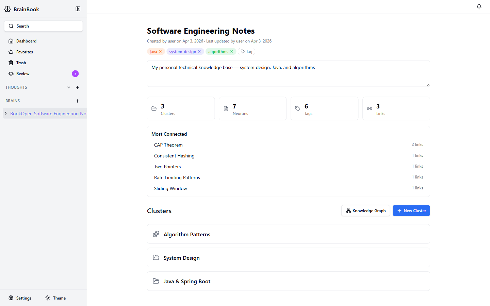
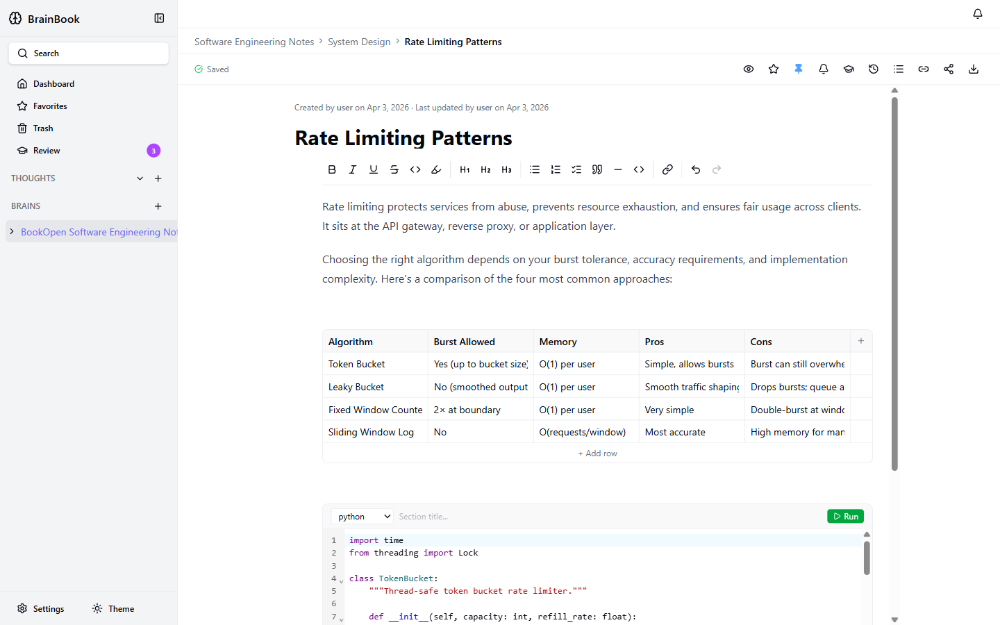
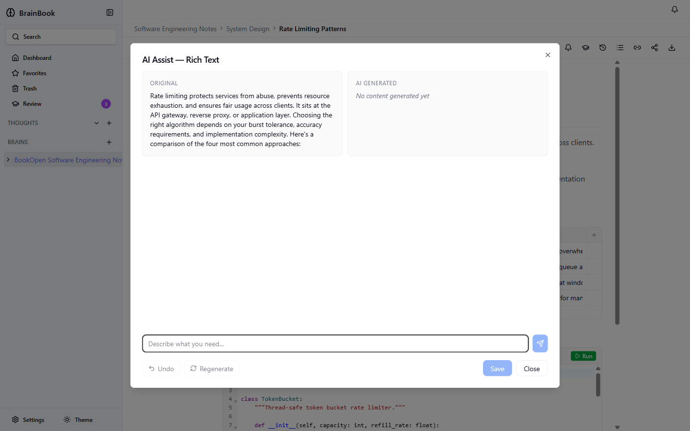
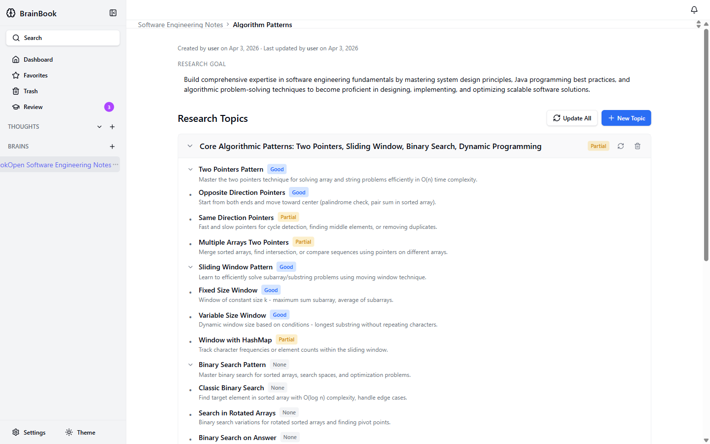
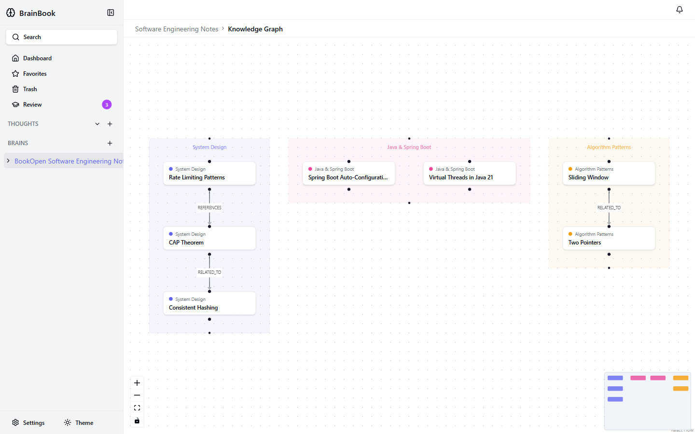
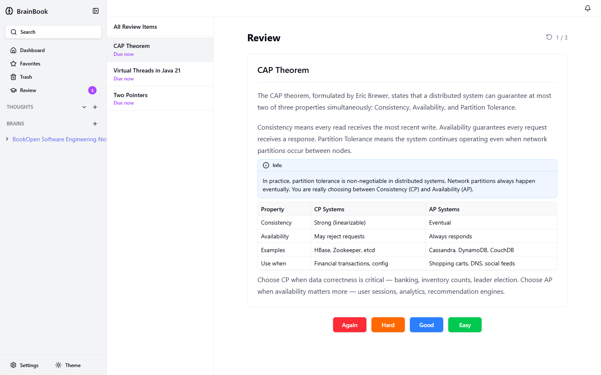
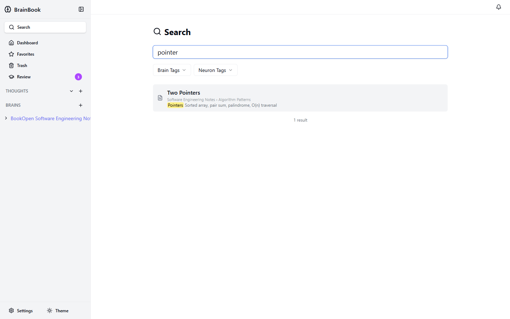
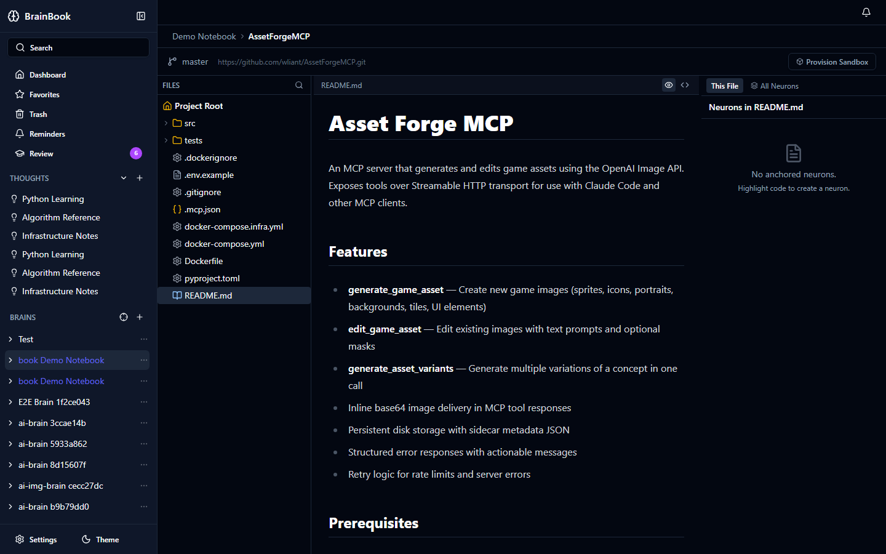
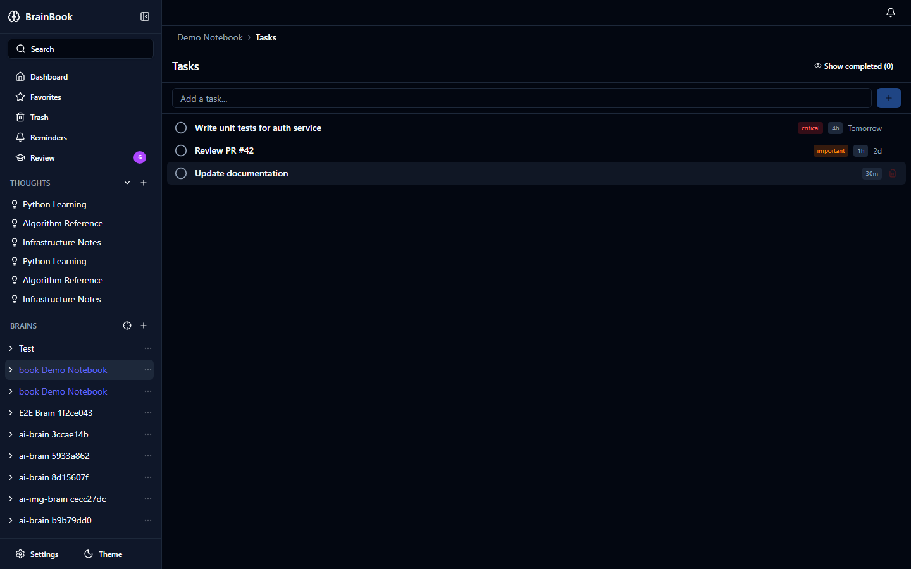

# BrainBook

**A self-hosted personal knowledge base** with AI-assisted writing, spaced repetition learning, code-anchored notes, and knowledge graph visualization.


---

## Screenshots

| Dashboard | Brain Overview |
|-----------|---------------|
|  |  |

| Rich Neuron Editor | AI Writing Assistant |
|-------------------|---------------------|
|  |  |

| AI Research Cluster | Knowledge Graph |
|--------------------|----------------|
|  |  |

| Spaced Repetition Review | Full-Text Search |
|--------------------------|-----------------|
|  |  |

| Project Cluster | Todo Cluster |
|----------------|--------------|
|  |  |

---

## Features

### Knowledge Management
- **Brains → Clusters → Neurons** — hierarchical organisation with tags, colours, and icons
- **Rich multi-section editor** — mix rich text, code (with syntax highlighting), tables, callouts, diagrams, math, images, and audio in a single note
- **Wiki-style neuron links** — manually link neurons with typed relationships (references, related-to, depends-on, …)
- **Revision history** — every save is tracked; restore any previous version instantly
- **Favorites, pinning, and soft delete** — keep important notes surfaced; recover deleted notes from trash

### AI-Powered Writing & Research
- **Inline AI Assist** — open an AI panel on any section to generate, rewrite, or extend content with a natural-language prompt
- **AI Research Clusters** — set a learning goal and let AI generate a structured research topic tree with sub-topics and completeness indicators
- **AI Quiz Generation** — automatically generate quiz questions from neuron content for active recall practice

### Spaced Repetition & Active Learning
- **SM-2 algorithm** — the same scheduling algorithm used by Anki
- **Review queue** — see what's due today across all neurons
- **Quality ratings** — rate each review as Again / Hard / Good / Easy to adapt the schedule
- **Per-neuron configuration** — enable/disable quiz mode and set question count per neuron

### Project Clusters (Code-Anchored Notes)
- **File tree browser** — explore any GitHub repository with syntax-highlighted code viewing and color-coded file-type icons
- **Image & Markdown preview** — images render inline; Markdown files show a rendered/source toggle
- **Anchor neurons to code** — link a note to a specific file, line range, or folder; anchors track drift across commits
- **Sandbox mode** — provision a server-side git clone for full IDE-level navigation: branch switching, blame, diff, commit log, and tree-sitter code intelligence
- **Private repository support** — configure a GitHub Personal Access Token to browse and clone private repos

### Task Management (Todo Clusters)
- **Quick-add task bar** — create tasks inline without leaving the view
- **Priority levels** — mark tasks as Critical, Important, or Normal
- **Due dates & completion** — track deadlines with visual badges; toggle completion inline
- **Auto-recurring reminders** — overdue tasks automatically generate a daily reminder at 7 pm local time until resolved

### Discovery & Navigation
- **Interactive knowledge graph** — visualize all neurons and their connections in a zoomable graph, colour-coded by cluster
- **Full-text search** — search across all neurons with highlighted context snippets
- **Tag filtering** — filter by brain tags or neuron tags with AND/OR logic
- **Thoughts** — create dynamic tag-based collections that automatically stay up to date

### Sharing & Export
- **Shareable links** — generate expiring public links for individual neurons (no login required for readers)
- **Markdown & PDF export** — export neurons to `.md` or print to PDF
- **Brain backup** — export an entire brain as JSON and re-import it elsewhere

---

## Tech Stack

| Layer | Technology |
|-------|-----------|
| Frontend | Next.js 16 (App Router), React 19, TypeScript, TipTap, Radix UI, Tailwind CSS |
| Backend | Spring Boot 3.5, Java 21, Flyway, JPA |
| Intelligence | FastAPI, LangGraph, Ollama / Anthropic Claude |
| Sandbox Service | Go, gRPC |
| Database | PostgreSQL 16 |
| Storage | MinIO (S3-compatible) |
| Infrastructure | Docker Compose |

---

## Quick Start

**Prerequisites:** Docker and Docker Compose.

```bash
# 1. Clone the repo
git clone https://github.com/wliant/AhLianBrainBook.git
cd AhLianBrainBook

# 2. Configure environment
cp .env.example .env
# Edit .env — set database password, MinIO keys, and LLM provider

# 3. Start the full stack
docker compose --env-file .env \
  -f docker-compose.infra.yml \
  -f docker-compose.app.yml \
  up -d

# 4. Open in browser
open http://localhost:3000
```

The first startup pulls images and runs database migrations automatically.

**LLM configuration:** Set `LLM_PROVIDER=ollama` and point `OLLAMA_BASE_URL` at a running [Ollama](https://ollama.com) instance, or set `LLM_PROVIDER=anthropic` with your `ANTHROPIC_API_KEY`. AI features (writing assist, research clusters, quiz generation) require a working LLM connection.

---

## Contributing

See [CONTRIBUTING.md](CONTRIBUTING.md) for local dev setup, project structure, and contribution guidelines.

---

## License

Apache 2.0 — see [LICENSE](LICENSE).
